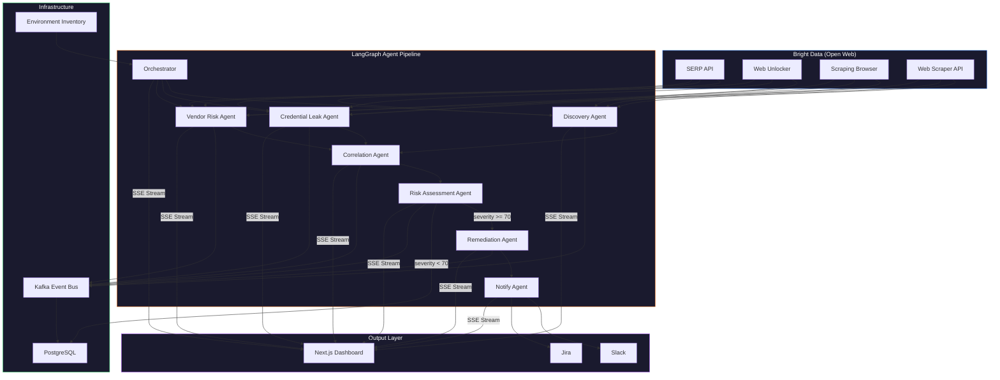
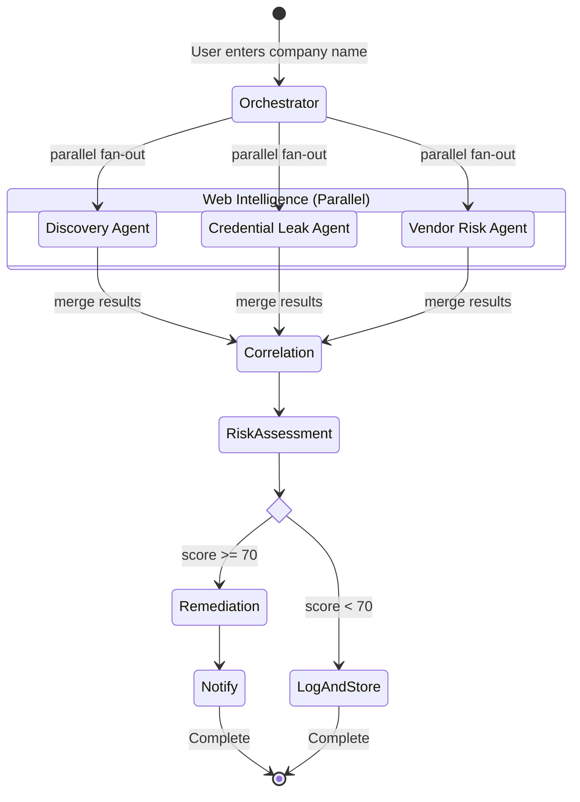
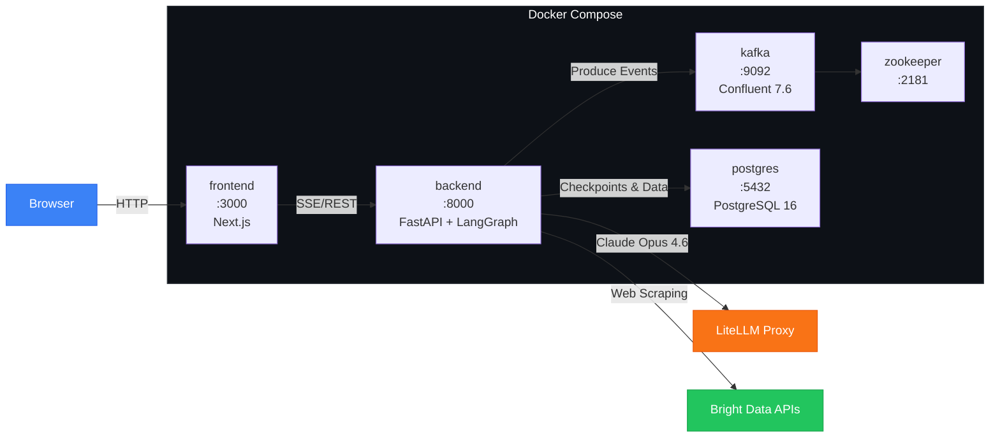
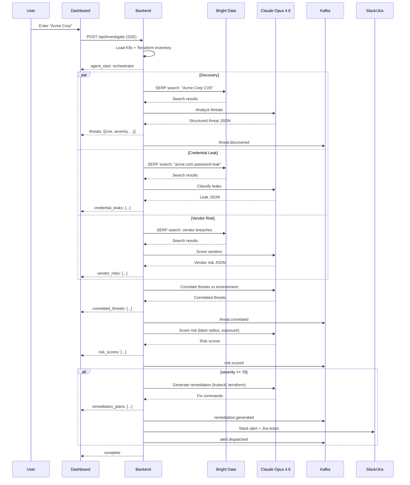
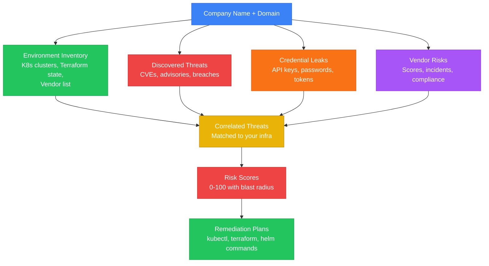

# SentinelAI — Autonomous Infrastructure Threat Intelligence Agent

> An AI-powered agent that continuously monitors the open web for security threats against your infrastructure — discovers CVEs, correlates them against your environment, assesses vendor risk, detects credential leaks, and generates remediation plans. Autonomously.

**Hackathon:** [Bright Data AI Agents Web Data Hackathon](https://lablab.ai/ai-hackathons/brightdata-ai-agents-web-data-hackathon)
**Track:** 3 — Security & Compliance

---

## The Problem

SRE and security teams face two worlds that never connect:

**The open web** — where Kubernetes CVEs drop, AWS advisories publish, vendor breaches surface, credentials leak on paste sites, and regulatory changes appear — across hundreds of scattered sources no SIEM monitors.

**Your infrastructure** — your Kubernetes clusters, Terraform state, AWS accounts, SaaS vendors, and container images — where those threats actually land.

Today, a human must manually bridge these worlds: check advisory feeds, cross-reference against running versions, assess impact, write remediation plans, create tickets, and notify the team. This takes **days per threat**. Most threats are never investigated at all.

## The Solution

SentinelAI is an **autonomous AI agent** that bridges these worlds in real time.

It scrapes the open web using Bright Data for live threat intelligence, correlates findings against your actual environment inventory, scores risk with full infrastructure context, and produces actionable remediation plans — complete with Slack notifications and ticket creation.

### The Killer Demo

> *"A new Kubernetes CVE drops. SentinelAI discovers it on the web within minutes, determines which of your clusters run the affected version, explains the blast radius, generates a remediation plan with exact kubectl/Terraform commands, creates a Jira ticket, and alerts your Slack channel — all autonomously."*

That's what judges will remember.

---

## What It Monitors

### Web Intelligence (via Bright Data)
- **Kubernetes Security Advisories** — k8s.io, GitHub advisories, security mailing lists
- **AWS Security Bulletins** — AWS advisories, service health, IAM policy changes
- **CVE Feeds** — NVD, MITRE, GitHub Security Advisories for dependencies
- **Vendor & SaaS Status** — Third-party provider breach announcements, status pages, incident histories
- **Credential Leaks** — Paste sites, code repositories, breach databases for org-specific exposure
- **Regulatory Updates** — Compliance body websites for new rules affecting your industry

### Environment Context (your inventory)
- Kubernetes cluster versions, namespaces, running images
- Terraform state (AWS resources, versions, configurations)
- Container image manifests and dependency trees
- SaaS/vendor inventory

---

## Architecture

### System Overview



### LangGraph Agent Graph



### Docker Compose Stack



### Event-Driven Pipeline



### Data Flow Through Agents



Each node is a LangGraph `StateGraph` node backed by Claude Opus 4.6 via LiteLLM. State flows through the graph as a typed dictionary, and LangGraph handles checkpointing, retries, and streaming automatically.

### Event-Driven Pipeline

The Kafka event bus isn't decoration — it makes the system **production-grade**:

1. **`threat.discovered`** — Discovery Agent finds a new CVE/advisory/leak on the web
2. **`threat.correlated`** — Correlation Agent matches it against your environment inventory
3. **`risk.scored`** — Risk Assessment Agent calculates severity with full infrastructure context
4. **`remediation.generated`** — Remediation Agent produces fix commands, Terraform patches, or upgrade paths
5. **`alert.dispatched`** — Notification sent to Slack, ticket created in Jira

Each event is independent. You can replay, audit, and debug every step. This is how real SRE systems work.

---

## Agent Pipeline (6 Specialized Agents)

### 1. Discovery Agent (Web Intelligence)
Continuously scrapes the open web for new threats using all Bright Data tools:
- SERP API searches for `"kubernetes CVE" site:github.com OR site:nvd.nist.gov` and similar queries
- Web Unlocker accesses advisory pages that block scrapers (NVD, vendor security portals)
- Scraping Browser navigates JS-heavy GitHub Security Advisories and AWS bulletin pages
- Web Scraper API extracts structured data from CVE databases and vendor status pages
- **Output:** Structured threat objects with CVE ID, severity, affected versions, source URL

### 2. Correlation Agent (Environment Matching)
Takes discovered threats and correlates against your infrastructure inventory:
- Matches CVE affected versions against running Kubernetes versions
- Cross-references vulnerable container images against deployed pods
- Checks Terraform state for affected AWS resource configurations
- Maps vendor breaches to your SaaS dependency list
- **Output:** Affected resources list with exact cluster/namespace/service/account details

### 3. Risk Assessment Agent (Severity Scoring)
Calculates contextual risk score (not just CVSS — actual blast radius in YOUR environment):
- How many clusters/services are affected?
- Is the affected component internet-facing or internal-only?
- Are there existing mitigations (network policies, WAF rules)?
- What's the exploit complexity vs. your exposure?
- **Output:** Risk score (0-100), blast radius assessment, exploitability rating

### 4. Remediation Agent (Fix Generation)
Generates actionable, environment-specific remediation plans:
- Exact `kubectl` commands to patch or roll back
- Terraform code changes to update affected resources
- Helm chart version bumps with diff preview
- Container image upgrade paths
- **Output:** Step-by-step remediation plan with copy-paste commands

### 5. Credential Leak Agent (Exposure Detection)
Scans the open web for leaked credentials tied to your organization:
- SERP API + Web Unlocker search paste sites, code repos, breach databases
- Matches findings against your domain, email patterns, service accounts
- AI classifies severity: API keys vs. user passwords vs. service tokens
- **Output:** Exposure list with severity, source, affected accounts, recommended rotation

### 6. Vendor Risk Agent (Third-Party Assessment)
Continuously monitors your SaaS/vendor supply chain:
- Scrapes vendor status pages, breach announcements, security advisories
- SERP API searches for vendor breach news, lawsuits, compliance failures
- Compares vendor security posture over time
- **Output:** Per-vendor risk score, incident timeline, contract risk flags

---

## Bright Data Integration

Every tool serves a distinct, critical purpose — no filler:

| Tool | What It Does in SentinelAI |
|---|---|
| **SERP API** | Searches across search engines for new CVEs, breach announcements, vendor incidents, credential leaks, regulatory changes |
| **Web Unlocker** | Bypasses anti-bot protection on NVD, AWS bulletins, vendor security portals, paste sites, and regulatory body websites |
| **Scraping Browser** | Navigates JS-heavy sites: GitHub Security Advisories, AWS Health Dashboard, SaaS status pages with dynamic content |
| **Web Scraper API** | Structured extraction from CVE databases, compliance registries, vendor incident pages — returns clean JSON |
| **MCP Server** | Connects Claude directly to Bright Data — the AI agent autonomously decides what to scrape and when |

---

## Tech Stack

| Layer | Technology | Why |
|---|---|---|
| **Infrastructure** | Docker + Docker Compose | One command to launch the entire stack — zero local dependencies |
| Frontend | Next.js 14 + Tailwind + shadcn/ui | Fast, polished dashboard for demo |
| Backend | Python FastAPI | Best AI/agent ecosystem, async-native |
| Agent Framework | **LangGraph** | Stateful, graph-based multi-agent orchestration with cycles, branching, and human-in-the-loop |
| LLM | **Claude Opus 4.6** via LiteLLM (`https://litellm.com`) | Most capable reasoning model, accessed through LiteLLM proxy for unified API |
| Bright Data + AI | MCP Server | Claude agents autonomously call Bright Data tools via MCP |
| Event Bus | Kafka (Confluent 7.6, containerized) | Event-driven pipeline, production-grade architecture |
| Database | PostgreSQL 16 (containerized) | Threat history, LangGraph checkpoints, audit trail |
| Real-time | Server-Sent Events (SSE) + WebSocket | Live agent trace + dashboard updates |
| Infra Parsing | `kubernetes` Python client, `python-hcl2` | Parse real k8s state and Terraform files |
| Notifications | Slack SDK + Jira REST API | Automated alerting and ticket creation |
| Scraping | Bright Data SDK (all 5 tools) | Full open-web access with anti-bot bypass |

### Why LangGraph

LangGraph gives us what raw LLM calls can't:

- **Stateful graph execution** — Each agent is a node in a directed graph. Edges define the flow: Discovery → Correlation → Risk → Remediation. Cycles allow agents to re-investigate when new information surfaces.
- **Parallel fan-out** — Discovery, Credential Leak, and Vendor Risk agents run simultaneously as parallel branches, merging results before Correlation.
- **Checkpointing** — Every graph state is persisted. If an agent fails mid-pipeline, resume from the last checkpoint — no re-scraping.
- **Human-in-the-loop** — Optional breakpoints before high-severity remediation actions (e.g., "Agent wants to create a P1 Jira ticket — approve?").
- **Streaming** — Native token-level and event-level streaming powers the real-time agent trace in the dashboard.

### LLM Configuration

All agents call Claude Opus 4.6 through the LiteLLM proxy:

```python
from langchain_openai import ChatOpenAI

llm = ChatOpenAI(
    model="claude-opus-4-6",
    base_url="https://litellm.com",
    api_key="your-litellm-key",
)
```

LiteLLM gives us unified OpenAI-compatible API, rate limiting, fallback routing, and usage tracking — all through a single endpoint.

---

## Dashboard Features

- **Threat Feed** — Real-time stream of discovered threats with severity badges
- **Environment Map** — Visual map of your infrastructure with affected components highlighted
- **Agent Trace** — Live view of AI agent reasoning: what it searched, what it correlated, why it scored a threat high
- **Risk Matrix** — Heatmap of threats by severity vs. blast radius
- **Remediation Queue** — Prioritized list of fixes with one-click Jira ticket creation
- **Vendor Scorecard** — Risk scores for all third-party vendors with trend lines
- **Credential Exposure** — Leaked credentials dashboard with rotation status tracking
- **Timeline** — Historical view of all threats, correlations, and remediations

---

## Demo Flow (3 Minutes That Win)

1. **Show the environment** — Pre-loaded with a real Kubernetes cluster inventory and Terraform state
2. **Trigger discovery** — Agent finds a new Kubernetes CVE (e.g., `CVE-2024-XXXX`) via Bright Data web scraping
3. **Watch correlation** — Agent checks your clusters: *"2 of 3 clusters run affected version 1.28.2"*
4. **See risk scoring** — *"Risk: 85/100 — affected clusters are internet-facing, no network policy mitigations"*
5. **Get remediation** — Agent generates exact `kubectl` upgrade commands and Terraform changes
6. **Auto-notify** — Slack message appears, Jira ticket is created — all live
7. **Show the Kafka trail** — Every step is an auditable event in the bus

**Pre-cache a real CVE scenario** so the demo is instant and reliable. The audience sees the full pipeline in 3 minutes.

---

## Project Structure

```
sentinel-ai/
├── backend/
│   ├── main.py                    # FastAPI app, SSE endpoints, WebSocket
│   ├── graph/
│   │   ├── state.py               # LangGraph shared state (TypedDict)
│   │   ├── builder.py             # StateGraph definition — nodes, edges, conditionals
│   │   └── checkpointer.py        # PostgreSQL checkpointer for graph persistence
│   ├── agents/
│   │   ├── orchestrator.py        # Orchestrator node — decomposes investigation
│   │   ├── discovery.py           # Discovery node — web intel via Bright Data
│   │   ├── correlation.py         # Correlation node — matches threats to env
│   │   ├── risk_assessment.py     # Risk node — contextual severity scoring
│   │   ├── remediation.py         # Remediation node — kubectl/terraform fixes
│   │   ├── credential_leak.py     # Credential leak node — exposure scanning
│   │   ├── vendor_risk.py         # Vendor risk node — third-party monitoring
│   │   └── notify.py              # Notification node — Slack/Jira dispatch
│   ├── tools/
│   │   ├── brightdata_serp.py     # SERP API as LangChain Tool
│   │   ├── brightdata_unlocker.py # Web Unlocker as LangChain Tool
│   │   ├── brightdata_browser.py  # Scraping Browser as LangChain Tool
│   │   ├── brightdata_scraper.py  # Web Scraper API as LangChain Tool
│   │   └── brightdata_mcp.py      # MCP Server integration
│   ├── environment/
│   │   ├── k8s_inventory.py       # Kubernetes cluster state parser
│   │   ├── terraform_parser.py    # Terraform state/HCL parser
│   │   └── vendor_inventory.py    # SaaS/vendor dependency list
│   ├── events/
│   │   ├── bus.py                 # Kafka producer/consumer wrapper
│   │   └── schemas.py            # Event schemas (Avro/JSON)
│   ├── integrations/
│   │   ├── slack.py               # Slack notification client
│   │   └── jira.py                # Jira ticket creation client
│   ├── models/
│   │   └── schemas.py             # Pydantic models for threats, reports
│   └── requirements.txt
├── frontend/
│   ├── app/
│   │   ├── page.tsx               # Landing — connect your environment
│   │   ├── dashboard/
│   │   │   └── page.tsx           # Main threat dashboard
│   │   ├── threat/[id]/
│   │   │   └── page.tsx           # Individual threat detail + remediation
│   │   └── vendors/
│   │       └── page.tsx           # Vendor risk scorecard
│   ├── components/
│   │   ├── ThreatFeed.tsx         # Real-time threat stream
│   │   ├── AgentTrace.tsx         # AI reasoning trace display
│   │   ├── RiskMatrix.tsx         # Severity × blast radius heatmap
│   │   ├── EnvironmentMap.tsx     # Infrastructure topology with highlights
│   │   ├── RemediationCard.tsx    # Fix plan with copy-paste commands
│   │   ├── VendorScorecard.tsx    # Vendor risk table with trends
│   │   └── KafkaTimeline.tsx      # Event bus audit trail
│   └── package.json
├── environment/
│   ├── sample-kubeconfig.yaml     # Sample k8s inventory for demo
│   ├── sample-terraform.tfstate   # Sample Terraform state for demo
│   └── sample-vendors.json        # Sample vendor list for demo
├── docker/
│   ├── backend.Dockerfile         # Python FastAPI + LangGraph agent
│   ├── frontend.Dockerfile        # Next.js multi-stage build
│   └── nginx.conf                 # Reverse proxy config
├── docker-compose.yml             # Full stack: backend, frontend, kafka, postgres, zookeeper
├── docker-compose.dev.yml         # Dev overrides: hot-reload, volume mounts
├── .env.example
├── Makefile                       # make up, make down, make logs, make demo
└── README.MD
```

---

## How to Run

### Prerequisites

- Docker & Docker Compose v2+
- Bright Data account ([brightdata.com](https://brightdata.com))
- LiteLLM API key (for Claude Opus 4.6)

That's it. Everything else runs in containers.

### Step 1: Clone & Configure

```bash
git clone https://github.com/YOUR_USERNAME/sentinel-ai.git
cd sentinel-ai
cp .env.example .env
```

### Step 2: Get Your API Keys

Edit `.env` and fill in the required values:

```bash
# 1. LLM — Claude Opus 4.6 via LiteLLM proxy
LITELLM_BASE_URL=https://litellm.com
LITELLM_API_KEY=<your-litellm-key>
LITELLM_MODEL=claude-opus-4-6

# 2. Bright Data — get from https://brightdata.com/cp
BRIGHTDATA_API_KEY=<your-api-key>

# 3. Scraping Browser — create a zone at Bright Data dashboard:
#    Proxies & Scraping → Add → Scraping Browser → copy the wss:// URL
BRIGHTDATA_SCRAPING_BROWSER_WS=wss://brd-customer-<ID>-zone-<ZONE>:<PASS>@brd.superproxy.io:9222
```

### Step 3: Launch the Stack

```bash
# Build and start all 5 services
docker compose up -d
```

This starts:

| Service | Port | URL |
|---|---|---|
| **Frontend** | `3000` | http://localhost:3000 |
| **Backend API** | `8000` | http://localhost:8000/docs |
| **Kafka** | `9092` | (internal event bus) |
| **Zookeeper** | `2181` | (Kafka coordination) |
| **PostgreSQL** | `5432` | (threat history + checkpoints) |

### Step 4: Open the Dashboard

Go to **http://localhost:3000**, type an organization name, and hit **Investigate Threats**.

Watch the AI agents scan the web in real time.

---

### Development Mode (Hot Reload)

```bash
docker compose -f docker-compose.yml -f docker-compose.dev.yml up
```

Source code is mounted as volumes — changes in `backend/` and `frontend/` auto-reload.

### Run Without Docker (Local Dev)

```bash
# Terminal 1: Backend
cd backend
python -m venv venv && source venv/bin/activate
pip install -r requirements.txt
playwright install chromium
uvicorn main:app --reload --port 8000

# Terminal 2: Frontend
cd frontend
npm install
npm run dev
```

> Note: Kafka and PostgreSQL still need Docker. Run them separately:
> ```bash
> docker compose up kafka zookeeper postgres -d
> ```

### Makefile Shortcuts

```bash
make up            # docker compose up -d
make dev           # docker compose with hot-reload
make down          # docker compose down
make logs          # docker compose logs -f
make logs-backend  # docker compose logs -f backend
make restart       # docker compose restart
make build         # docker compose build --no-cache
make clean         # docker compose down -v (removes volumes + data)
make demo          # seed demo data + launch stack
```

### Verify It's Running

```bash
# Check all services are up
docker compose ps

# Backend health check
curl http://localhost:8000/health

# View backend logs
docker compose logs -f backend

# View environment inventory (sample data)
curl http://localhost:8000/api/environment | python -m json.tool
```

### Environment Variables Reference

| Variable | Required | Description |
|---|---|---|
| `LITELLM_BASE_URL` | Yes | LiteLLM proxy URL |
| `LITELLM_API_KEY` | Yes | LiteLLM API key for Claude Opus 4.6 |
| `LITELLM_MODEL` | Yes | Model name (`claude-opus-4-6`) |
| `BRIGHTDATA_API_KEY` | Yes | Bright Data API key from dashboard |
| `BRIGHTDATA_SCRAPING_BROWSER_WS` | Yes | Scraping Browser WebSocket URL (`wss://...`) |
| `BRIGHTDATA_SERP_API_URL` | Yes | SERP API endpoint |
| `BRIGHTDATA_WEB_UNLOCKER_URL` | Yes | Web Unlocker endpoint |
| `KAFKA_BOOTSTRAP_SERVERS` | Auto | Set by Docker Compose (`kafka:29092`) |
| `DATABASE_URL` | Auto | Set by Docker Compose |
| `SLACK_WEBHOOK_URL` | No | Slack incoming webhook for alerts |
| `JIRA_BASE_URL` | No | Jira instance URL |
| `JIRA_API_TOKEN` | No | Jira API token |
| `JIRA_PROJECT_KEY` | No | Jira project key for tickets |

### Troubleshooting

| Problem | Fix |
|---|---|
| `kafka` keeps restarting | Wait 30s — Kafka needs Zookeeper to be ready first. Check: `docker compose logs kafka` |
| Backend can't reach Kafka | Ensure `KAFKA_BOOTSTRAP_SERVERS=kafka:29092` (Docker internal DNS) |
| Frontend shows blank page | Check `NEXT_PUBLIC_API_URL` is set. For local dev, use `http://localhost:8000` |
| Bright Data 403 errors | Verify your API key and Scraping Browser zone are active at [brightdata.com/cp](https://brightdata.com/cp) |
| `playwright` errors | Run `playwright install chromium` inside the backend container or locally |
| Port already in use | Stop conflicting services or change ports in `docker-compose.yml` |

---

## Implementation Timeline

### Phase 1: Foundation (Hours 1-8)
- Docker Compose stack: backend, frontend, Kafka, Zookeeper, PostgreSQL
- Dockerfiles for backend (Python 3.11) and frontend (Next.js multi-stage)
- Makefile for common operations (`make up`, `make logs`, `make demo`)
- LangGraph `StateGraph` definition with shared state schema
- LiteLLM integration (Claude Opus 4.6 via `https://litellm.com`)
- Bright Data tools wrapped as LangChain Tools (all 5 + MCP)
- Environment parsers (Kubernetes inventory + Terraform state)
- Kafka event bus with topic schemas

### Phase 2: Core Agent Pipeline (Hours 8-20)
- Orchestrator node with parallel fan-out logic
- Discovery Agent — CVE/advisory scraping end-to-end
- Correlation Agent — match threats to environment
- Risk Assessment Agent — contextual scoring
- Remediation Agent — generate kubectl/terraform fixes

### Phase 3: Dashboard + Secondary Agents (Hours 20-36)
- Real-time dashboard with threat feed, risk matrix, agent trace
- Credential Leak Agent
- Vendor Risk Agent
- Slack + Jira integration
- Remediation detail view with copy-paste commands

### Phase 4: Demo + Polish (Hours 36-48)
- Pre-cache a real CVE scenario for reliable demo
- Record video walkthrough
- End-to-end testing
- Final UI polish and submission

---

## Why SentinelAI Wins

| Criteria | How We Deliver |
|---|---|
| **Novelty** | Not a generic LLM wrapper — an infrastructure-aware AI agent that correlates web threats against YOUR actual environment |
| **Domain Expertise** | Built by someone who runs Kubernetes, Terraform, and AWS in production — the architecture reflects real SRE workflows |
| **Bright Data Integration** | All 5 tools used for distinct, critical web intelligence tasks — MCP makes the agent autonomous |
| **Production Architecture** | Kafka event bus, environment parsers, Slack/Jira integration — this looks like it could ship |
| **Demo Impact** | "CVE drops → agent finds it → checks your clusters → generates fix → creates ticket → alerts Slack" in 3 minutes |
| **Real-World Value** | Every company with Kubernetes needs this. Existing tools (Snyk, Wiz) cost $50K+/year and don't do autonomous web intelligence |
| **Completeness** | Dashboard, agent reasoning trace, remediation plans, vendor risk, credential monitoring — feels like a product, not a prototype |

---

## License

MIT
https://youtu.be/YbmkhzxDZ-E